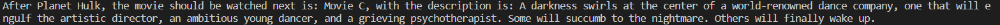

# Apply Python NLP library - SpaCy

This project applies SpaCy - a Python NLP library - to analyse garden-path sentences.
Tokenisation and Entity recognition were employed in this project.

## Installation <a name="installation"/>

There is aa very easy way to run this program on your computer, i.e., Using my online Docker image.


### Using Docker image

- Download and install [Docker](https://www.docker.com/products/docker-desktop/). You may need to update your Linux as well, when the demand prompted.

- To confirm if you successfully install Docker, run this command in your CP:

```bash
docker run hello-world
```

- With the Docker app opened, run this code in your CP:

```bash
docker run andrewthien/my-garden
```

- When finished, you should see the out come of this program, similar to the picture in usage section.

### Note: please read the Usage section for more details


## Table of Contents
### 1. [Installation](#installation)
### 2. [Usage](#usage)
### 3. [Contributing](#contributing)
### 4. [Credits](#credits)


## Usage <a name="usage"/>

#### The program can be used to analyse and perform entity recognition which will be useful in machine learning and AI applications.
#### After running the project, you should see the outcome as below. That is the results when tokenisation and entity recognition were done on a list of some garden-path sentences.




### Note: Each sentence were examined, and below the list of tokenised elements in the sentence, the entity recognition was just performed and show the result of that process for the sentence above it. 

## Contributing <a name="contributing"/>

Pull requests are welcome. For major changes, please open an issue first to discuss what you would like to change.

## Credits <a name="credits"/>

[Tri Thien Nguyen](https://www.linkedin.com/in/tri-thien-nguyen/)
